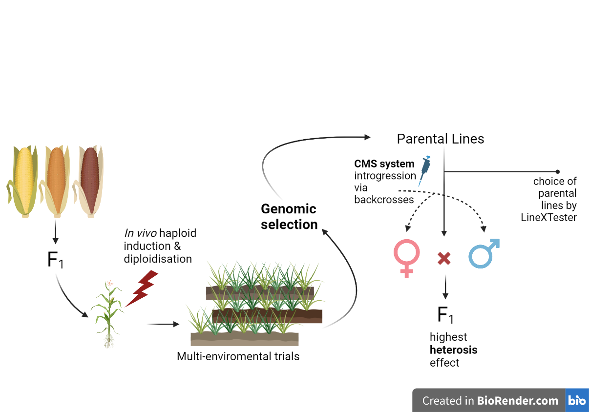

# Breeding Program for Maize Improvement

This is Skoltech Modern Plant Breeding Workshop final project 2023 

## This repository is...

In this project, we aimed to analize the provided data and find the best lines for the further breeding.
Additionally, we provided breeding scheme  for maize improvement by using modern plant breeding approaches

## Team:

+ Vasiliy Zubarev
+ Vladislav Mityukov

